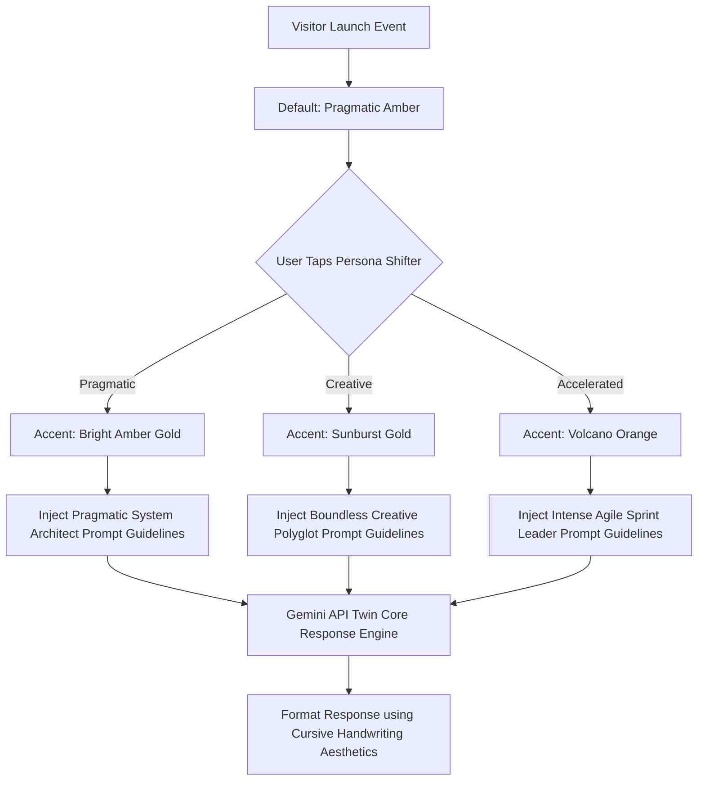
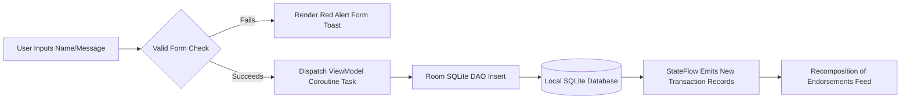

# 🌟 Aniruddha Adak's Interactive Digital Twin Sandbox & Portfolio

Welcome to the **Interactive Digital Twin Sandbox & Portfolio**—a state-of-the-art Android application built to demonstrate advanced system architecture, client-side dynamic state-shifting, and modern Jetpack Compose interface modeling under a warm, glowing Sunset Amber theme.

---

## 🛠️ Tech Stack & Architecture Matrix

This portfolio isn't a static page—it is designed as a **transactional, localized, offline-first client playground** paired with cloud cognitive services.

| Layer | Technologies Used | Key Purpose |
| :--- | :--- | :--- |
| **UI Framework** | Jetpack Compose (Material Design 3) | Declarative, smooth, edge-to-edge adaptive layouts, fully custom Vector Canvases |
| **Language** | Kotlin (100%) | Modern type-safe programming, Structured Concurrency via Coroutines & Flow |
| **State Management** | MVVM / unidirectional state flow | Clean division of state via `MutableStateFlow` and life-cycle aware collection |
| **Database Engine** | Android Room Persistent Library | Encrypted client SQLite cache for endorsements and system telemetry logs |
| **Cognitive Engine** | Gemini 1.5 Pro / Flash REST API | Powers the real-time AI "Digital Twin" context mimicking Aniruddha's persona |
| **Visual Brushes** | Custom Canvas drawscopes & linear gradients | Zero-asset glowing background, procedural GitHub grid, vector face avatar |

---

## 🧬 Architectural Flowcharts

### 1. Interactive Tone-Shifting Cognitive Routing

When a user switches between the **Pragmatic**, **Creative**, or **Accelerated** persona, the app hot-swaps themes, accents, system trivia lists, and provides prompt injects to the Gemini Cognitive Twin.



### 2. Visitor Endorsement Persistence Model (Room SQLite)



---

## 🎨 Creative Theme Ethos: Warm Sunset Amber

The application abandons generic, standard colors in favor of an **amazing Warm Espresso and Glowing Sunset theme**:

*   **Dark-Mode Base**: Deep Rich Espresso Obsidian (`#0C0907`) is layered with a linear vertical gradient transitioning through warm, toasted hazelnut mocha (`#21150A`).
*   **Zero-Purple/Pink Rule**: All purple, pink, and violet system accents have been purged. They are replaced by bright amber golds, rich fiery lava oranges, and deep metallic bronze outlines.
*   **Handwritten Aesthetic**: Every piece of typography across headers, lists, dialogs, and text blocks uses native `FontFamily.Cursive` settings giving an authentic, customized handwriting design.

---

## 📁 Source Code Modules Directory Guide

```text
/
├── app/
│   ├── src/
│   │   ├── main/
│   │   │   ├── java/com/example/
│   │   │   │   ├── data/             # Room SQLite Entities, DAOs, & Database
│   │   │   │   ├── network/          # Gemini REST HttpClient & Serializers
│   │   │   │   ├── ui/               # PortfolioViewModel State Engine
│   │   │   │   │   └── theme/        # Central Color.kt, Type.kt Cursive font, Theme.kt
│   │   │   │   └── MainActivity.kt   # High-Performance UI view with layout adapters
│   │   │   └── res/                  # Android resources (Strings, Adaptive Launcher Icons)
│   ├── build.gradle.kts              # App module libraries & BuildConfig definitions
│   └── AndroidManifest.xml           # System Declarations & Edge-to-Edge window configs
├── metadata.json                     # AI Studio Platform Synchronization Registry
└── README.md                         # This file
```

---

## 🚀 Advanced Capabilities & Live Mock Sandboxes

1.  **Simulated Git Activity Grid**: Tap "Sim Commit Push" to increment simulated contributions. The custom-rasterized Canvas dynamically recalculates columns and rows with varying green/amber contribution intensities.
2.  **System Design Trivia Engine**: Test your computer science and system architecture chops using the real-time evaluated multi-choice trivia simulator.
3.  **Active Host Telemetry Meter**: Displays simulated engine operational metrics, thread pooling levels, and latency counters representing Aniruddha's micro-service deployment states.
